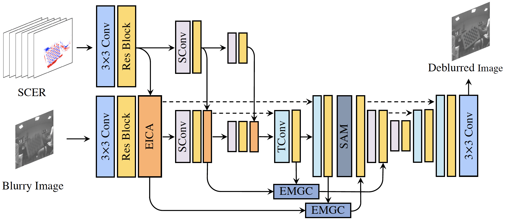
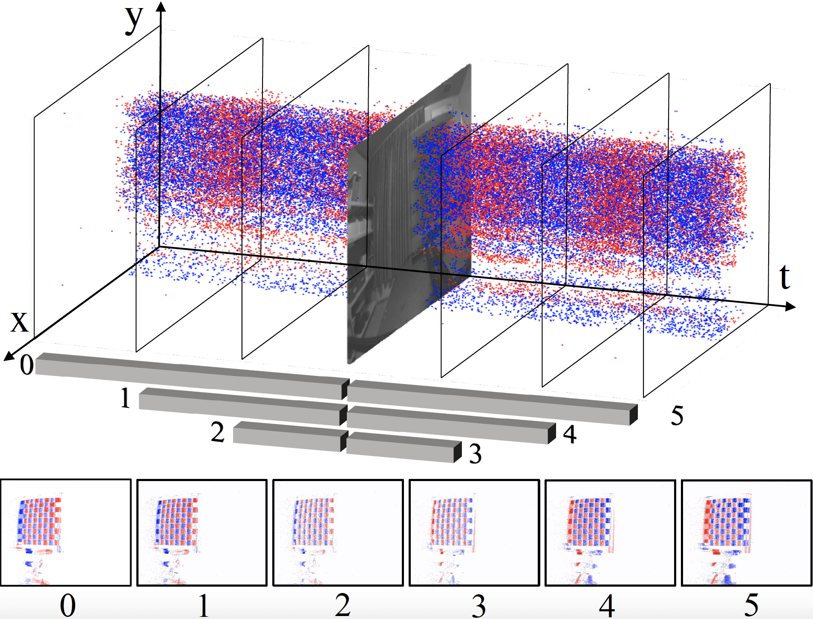
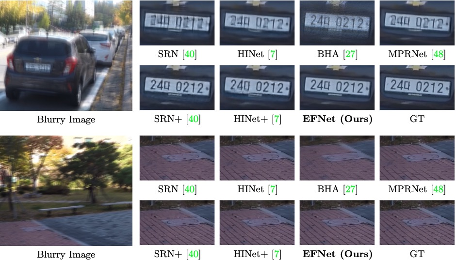
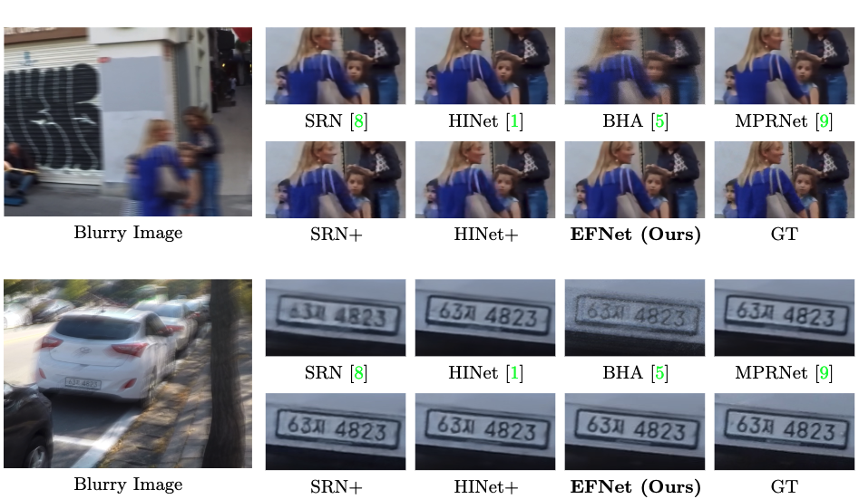
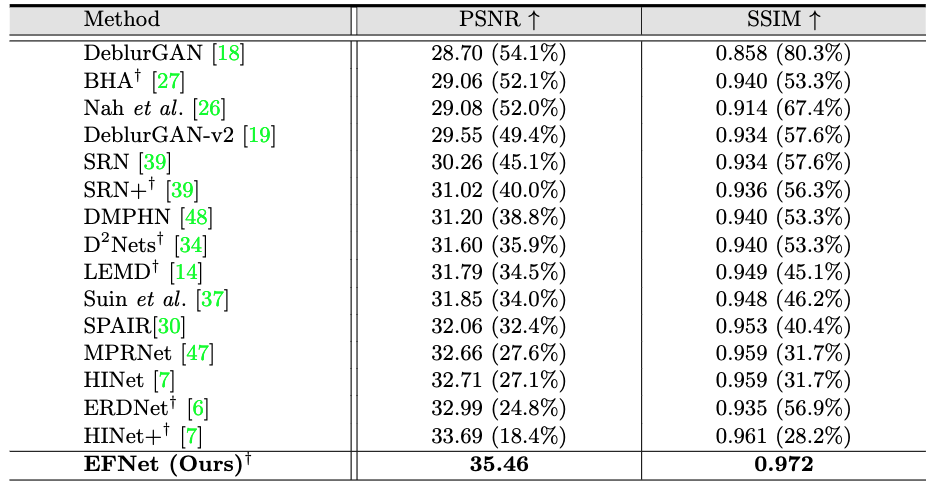
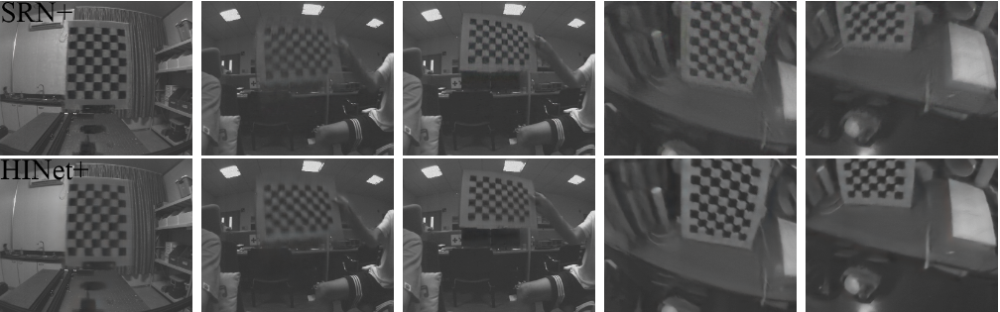
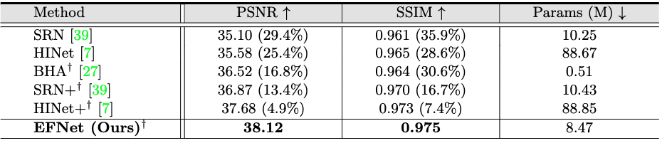

[](https://paperswithcode.com/sota/deblurring-on-gopro?p=mefnet-multi-scale-event-fusion-network-for)

Event-based Fusion for Motion Deblurring with Cross-modal Attention
---
#### Lei Sun, Christos Sakaridis, Jingyun Liang, Qi Jiang, Kailun Yang, Peng Sun, Yaozu Ye, Kaiwei Wang, Luc Van Gool
#### Paper: https://arxiv.org/pdf/2112.00167.pdf
> Traditional frame-based cameras inevitably suffer from motion blur due to long exposure times. As a kind of bio-inspired camera, the event camera records the intensity changes in an asynchronous way with high temporal resolution, providing valid image degradation information within the exposure time. In this paper, we rethink the eventbased image deblurring problem and unfold it into an end-to-end two-stage image restoration network. To effectively fuse event and image features, we design an event-image cross-modal attention module applied at multiple levels of our network, which allows to focus on relevant features from the event branch and filter out noise. We also introduce a novel symmetric cumulative event representation specifically for image deblurring as well as an event mask gated connection between the two stages of our network which helps avoid information loss. At the dataset level, to foster event-based motion deblurring and to facilitate evaluation on challenging real-world images, we introduce the Real Event Blur (REBlur) dataset, captured with an event camera in an illumination controlled optical laboratory. Our Event Fusion Network (EFNet) sets the new state of the art in motion deblurring, surpassing both the prior best-performing image-based method and all event-based methods with public implementations on the GoPro dataset (by up to 2.47dB) and on our REBlur dataset, even in extreme blurry conditions.


### News
- September 25: Update the dataset link. Datasets available now.
- July 14 2022: :tada: :tada: Our paper was accepted in ECCV'2022 as oral presentation (2.7% of the submission).
- July 14 2022: The repository is under construction.


### Network Architecture




### Symmetric Cumulative Event Representation (SCER)



### Results
<details><summary>GoPro dataset (Click to expand) </summary>



</details>

<details><summary>REBlur dataset (Click to expand) </summary>



</details>

### Installation
This implementation based on [BasicSR](https://github.com/xinntao/BasicSR) which is a open source toolbox for image/video restoration tasks. 

```python
python 3.8.5
pytorch 1.7.1
cuda 11.0
```


```
git clone https://github.com/AHupuJR/EFNet
cd EFNet
pip install -r requirements.txt
python setup.py develop --no_cuda_ext
```

### <span id="dataset_section"> Dataset </span> 
Use GoPro events to train the model. If you want to use your own event representation instead of SCER, download GoPro raw events and use EFNet/scripts/data_preparation/make_voxels_esim.py to produce your own event representation.

GoPro with SCER: [[ETH_share_link](https://data.vision.ee.ethz.ch/csakarid/shared/EFNet/GOPRO.zip)]  [[BaiduYunPan](https://pan.baidu.com/s/1TxWdMB2LjdlgIvuc6QN-Bg)/code: 3wm8]

REBlur with SCER: [[ETH_share_link](https://data.vision.ee.ethz.ch/csakarid/shared/EFNet/REBlur.zip)]  [[BaiduYunPan](https://pan.baidu.com/s/13v0CjlFUXt9TxXI0Co9tQQ?pwd=f6ha#list/path=%2F)/code:f6ha]

We also provide scripts to convert raw event files to SCER using scripts in [./scripts/data_preparation/](./scripts/data_preparation/). You can also design your own event representation by modify the script. Raw event files download:

GoPro with raw events: [[ETH_share_link](https://data.vision.ee.ethz.ch/csakarid/shared/EFNet/GOPRO_rawevents.zip)]  [[BaiduYunPan](link)/TODO]

REBlur with raw events: [[ETH_share_link](https://data.vision.ee.ethz.ch/csakarid/shared/EFNet/REBlur_rawevents.zip)]  [[BaiduYunPan](link)/TODO]


### Train
---
#### GoPro

* prepare data
  
  * download the GoPro events dataset (see [Dataset](dataset_section)) to 
    ```bash
    ./datasets
    ```

  * it should be like:
  
    ```bash
    ./datasets/
    ./datasets/DATASET_NAME/
    ./datasets/DATASET_NAME/train/
    ./datasets/DATASET_NAME/test/
    ```

* train

  * ```python -m torch.distributed.launch --nproc_per_node=4 --master_port=4321 basicsr/train.py -opt options/train/GoPro/EFNet.yml --launcher pytorch```

* eval
  * Download [pretrained model](https://drive.google.com/file/d/19O-B-K4IODMENQblwHbSqNu0TX0IF-iA/view?usp=sharing) to ./experiments/pretrained_models/EFNet-GoPro.pth
  * ```python basicsr/test.py -opt options/test/GoPro/EFNet.yml  ```
  

#### REBlur

* prepare data
  
  * download the REBlur dataset (see [Dataset](dataset_section)) to 
    ```bash
    ./datasets
    ```

  * it should be like:
  
    ```bash
    ./datasets/
    ./datasets/DATASET_NAME/
    ./datasets/DATASET_NAME/train/
    ./datasets/DATASET_NAME/test/
    ```

* finetune

  * ```python ./basicsr/train.py -opt options/train/REBlur/Finetune_EFNet.yml```

* eval
  * Download [pretrained model](https://drive.google.com/file/d/1yMGnwfYsxWbVp7r-oc8ls9qnOEDavG3h/view?usp=sharing) to ./experiments/pretrained_models/EFNet-REBlur.pth
  * ```python basicsr/test.py -opt options/test/REBlur/Finetune_EFNet.yml ```
  
### Results
TODO

### Qualitative results
All the qualitative results can be downloaded through Google Drive:

[GoPro test](https://drive.google.com/file/d/17jXR5U9e3-8dXPUxB0-wBhDFg60Oe8US/view?usp=sharing)

[REBlur test](https://drive.google.com/file/d/17jXR5U9e3-8dXPUxB0-wBhDFg60Oe8US/view?usp=sharing)

[REBlur addition](https://drive.google.com/file/d/17jXR5U9e3-8dXPUxB0-wBhDFg60Oe8US/view?usp=sharing)


### Citations

```
@inproceedings{sun2022event,
      author = {Sun, Lei and Sakaridis, Christos and Liang, Jingyun and Jiang, Qi and Yang, Kailun and Sun, Peng and Ye, Yaozu and Wang, Kaiwei and Van Gool, Luc},
      title = {Event-Based Fusion for Motion Deblurring with Cross-modal Attention},
      booktitle = {European Conference on Computer Vision (ECCV)},
      year = 2022
      }
```


### Contact
Should you have any questions, please feel free to contact leo_sun@zju.edu.cn or leisun@ee.ethz.ch.


### License and Acknowledgement

This project is under the Apache 2.0 license, and it is based on [BasicSR](https://github.com/xinntao/BasicSR) which is under the Apache 2.0 license. Thanks to the inspirations and codes from [HINet](https://github.com/megvii-model/HINet) and [event_utils](https://github.com/TimoStoff/event_utils)


