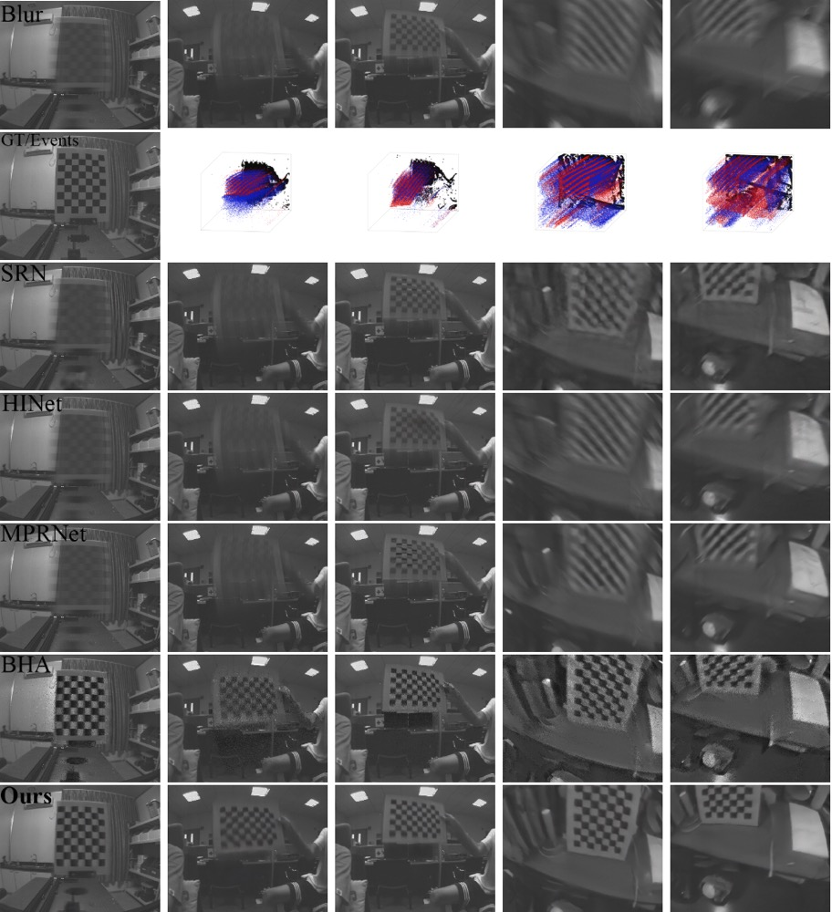

Event-based Fusion for Motion Deblurring with Cross-modal Attention
---
#### Lei Sun, Christos Sakaridis, Jingyun Liang, Qi Jiang, Kailun Yang, Peng Sun, Yaozu Ye, Kaiwei Wang, Luc Van Gool
#### Paper: https://arxiv.org/pdf/2112.00167.pdf
> Traditional frame-based cameras inevitably suffer from motion blur due to long exposure times. As a kind of bio-inspired camera, the event camera records the intensity changes in an asynchronous way with high temporal resolution, providing valid image degradation information within the exposure time. In this paper, we rethink the eventbased image deblurring problem and unfold it into an end-to-end two-stage image restoration network. To effectively fuse event and image features, we design an event-image cross-modal attention module applied at multiple levels of our network, which allows to focus on relevant features from the event branch and filter out noise. We also introduce a novel symmetric cumulative event representation specifically for image deblurring as well as an event mask gated connection between the two stages of our network which helps avoid information loss. At the dataset level, to foster event-based motion deblurring and to facilitate evaluation on challenging real-world images, we introduce the Real Event Blur (REBlur) dataset, captured with an event camera in an illumination controlled optical laboratory. Our Event Fusion Network (EFNet) sets the new state of the art in motion deblurring, surpassing both the prior best-performing image-based method and all event-based methods with public implementations on the GoPro dataset (by up to 2.47dB) and on our REBlur dataset, even in extreme blurry conditions.


### News
- July 14 2022: :tada: :tada: Our paper was accepted in ECCV 2022 as oral presentation (2.7% of the submission).
- July 14 2022: The repository is under construction.


### Network Architecture


### Symmetric Cumulative Event Representation (SCER)


### Results
<details><summary>GoPro dataset (Click to expand) </summary>


</details>

<details><summary>REBlur dataset (Click to expand) </summary>



</details>

### Installation
This implementation based on [BasicSR](https://github.com/xinntao/BasicSR) which is a open source toolbox for image/video restoration tasks. 

```python
python 3.8.5
pytorch 1.7.1
cuda 11.0
```


```
git clone https://github.com/AHupuJR/EFNet
cd EFNet
pip install -r requirements.txt
python setup.py develop --no_cuda_ext
```

### <span id="dataset_section"> Dataset </span> 
- [ ] Add link

GoPro events: [GoogleDrive](link)  [BaiduYunPan](link)

REBlur: [GoogleDrive](link)  [BaiduYunPan](link)


### Quick Start (Single Image and Corresponding Events Inference)
---

- [ ] TODO

### Train
---
#### GoPro

* prepare data
  
  * download the GoPro events dataset (see [Dataset](dataset_section)) to 
    ```bash
    ./datasets
    ```

  * it should be like:
  
    ```bash
    ./datasets/
    ./datasets/GoPro/
    ./datasets/GoPro/train/
    ./datasets/GoPro/test/
    ```

* train

  * ```python -m torch.distributed.launch --nproc_per_node=4 --master_port=4321 basicsr/train.py -opt options/train/GoPro/EFNet.yml --launcher pytorch```

* eval
  * - [ ] TODO: add link. download [pretrained model](link) to ./experiments/pretrained_models/EFNet-GoPro.pth
  * ```python basicsr/test.py -opt options/test/GoPro/EFNet.yml  ```
  

#### REBlur

* prepare data
  
  * download the REBlur dataset (see [Dataset](dataset_section)) to 
    ```bash
    ./datasets
    ```

  * it should be like:
  
    ```bash
    ./datasets/
    ./datasets/REBlur/
    ./datasets/REBlur/train/
    ./datasets/REBlur/test/
    ```

* finetune

  * ```python ./basicsr/train.py -opt options/train/REBlur/Finetune_EFNet.yml```

* eval
  * - [ ] TODO: add link. download [pretrained model](link) to ./experiments/pretrained_models/EFNet-REBlur.pth
  * ```python basicsr/test.py -opt options/test/REBlur/Finetune_EFNet.yml ```
  

### Citations

- [ ] TODO: add citation. 


### Contact
Should you have any questions, please contact leo_sun@zju.edu.cn or leisun@ee.ethz.ch.


### License and Acknowledgement

This project is under the Apache 2.0 license, and it is based on [BasicSR](https://github.com/xinntao/BasicSR) which is under the Apache 2.0 license. Thanks to the inspirations and codes from [HINet](https://github.com/megvii-model/HINet) and [MPRNet](https://github.com/swz30/MPRNet)


